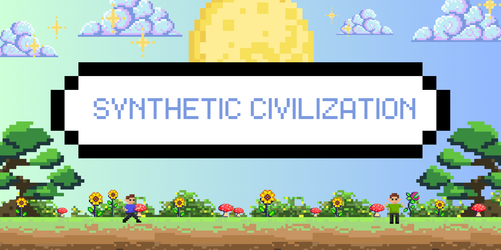

<div align="center">


# 🏛️ Synthetic Civilization Simulator
**A Deterministic Laboratory for Emergent Geopolitics**

[](https://opensource.org/licenses/MIT)
[](https://nodejs.org/)
[](#)


</div>

---

## 👋 What is this?

The **Synthetic Civilization Simulator** is a deterministic world simulation engine focused on how large-scale structures emerge from local behavior.

Instead of scripting outcomes, the simulator models interacting systems where trade, migration, cooperation, and conflict arise naturally from pressure and incentives. If something breaks down in the world, it’s because the conditions allowed it not because an event was injected.

I started building this because I wanted a way to pause a simulation, inspect a settlement, and understand *why* it’s struggling or growing instead of just watching things happen randomly.

---

## 🧱 Pillars

| **Deterministic** | **Bottom-Up Emergence** | **System Depth** |
| :--- | :--- | :--- |
| Same seed, same history. Useful for debugging and long-run analysis. | Nations and borders are not predefined they appear when agents cluster and interact. | Systems track pressure, demographics, influence, economy, and internal stability signals. |

---

## 🕹️ The Observatory (Dashboard)

The simulator includes a built-in UI for inspecting the world in real time.

<p align="center">
  
</p>

- **Trade Routes:** Links grow or shrink depending on activity and stability.
- **Stress Signals:** Economic, Security, Social, and Environmental factors help explain internal health.
- **Era History:** The engine identifies longer periods like expansion or crisis based on system trends.

---

## 🏗️ How it Works

The engine follows a layered model where no system has full global knowledge.

1. **Agents (Micro)**  
   Act on local information. They look for safety, resources, and opportunity.

2. **Settlements (Meso)**  
   Aggregate agent behavior into metrics like pressure and stability.

3. **Civilizations (Macro)**  
   Shape incentives through policy, diplomacy, and cultural alignment.

4. **The Loop**  
   `Micro → Meso → Macro → Feedback → Micro`

### Tick Structure

Every simulation tick follows a consistent order so runs remain reproducible:

`World Update → Agent Interactions → System Processing → Civilization Updates → Snapshot`

---

## ⚡ Quick Start

### Install

```bash
git clone https://github.com/sajidurdev/SyntheticCiv.git
cd SyntheticCiv
npm install
````

### Run

```bash
npm start
```

Open:

```
http://localhost:3000
```

### Debug Mode

For additional diagnostics:

```bash
SIM_DEBUG=1 npm start
```

---

## 🛠 Feature Grid

* [x] Deterministic RNG
* [x] Spatial indexing for agent proximity
* [x] Dynamic trade route formation
* [x] Settlement-level market pricing (local, emergent)
* [x] Price-aware barter valuation
* [x] Route arbitrage / price-gap coupling
* [x] Civilization diplomacy matrix
* [x] Culture
* [x] Deterministic market update ordering
* [x] Settlement market inspector panel
* [ ] Merchant arbitrage agents (planned)
* [ ] Cross-settlement price diffusion (planned)

---

## 🤝 Contributing

If you’re interested in simulations, systems modeling, or performance work, contributions are welcome.

Good areas to explore:

* UI improvements
* simulation performance
* new systemic mechanics
* debugging and visualization tools

Try to keep changes deterministic and avoid introducing hidden randomness into the tick loop.

---

## 💌 A Note from the Creator

This is one of the most ambitious projects I’ve worked on so far. I’ve always been curious about how small local changes can ripple outward and reshape an entire world, and this simulator is my attempt to explore that idea in a structured way.

The project is still evolving, and I’m continuously refining systems as I learn more. If something feels unclear or could be improved, feel free to open an issue or share feedback thoughtful suggestions genuinely help push this forward.

Thanks for taking the time to check it out.
